# 一步一步”手搓“一个简单的PE解析器

* 本文主要通过编写一个简单的PE解析器来加强对于PE结构的理解
* 项目地址：[bladchan/Simple-PE-Parser: A simple tool for parsing PE file (github.com)](https://github.com/bladchan/Simple-PE-Parser)

## Step 0: 预备工作

* 了解PE文件结构，参考资料[1-7]均介绍了PE的结构，这里不再赘述
* `winnt.h`，该头文件包含了很多PE文件格式中的结构体：https://github.com/Alexpux/mingw-w64/blob/master/mingw-w64-tools/widl/include/winnt.h
* 开源项目：https://github.com/hasherezade/pe-bear

## Step 1: 简单的识别PE文件与其类型

* 本节主要解决一个事，那就是确定给定的文件是否是一个PE文件
* 一个PE文件至少要满足两个条件：
  * `DOS Header`的标志`MZ`
    * 识别：文件前两个字节对应`MZ`的ASCII（0x5A4D）
    * 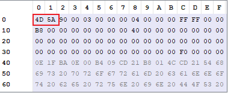
  * `NT Header`的标志`PE`
    * 识别：1. 获取DOS Header的指向`NT Headers`首部的偏移值；2. 取出前四个字节，并判断是否为`50 45 00 00`；
    * 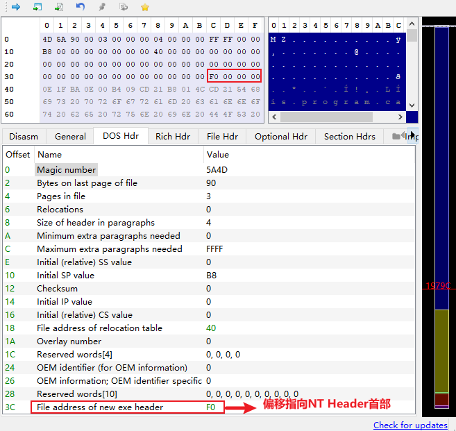
    * 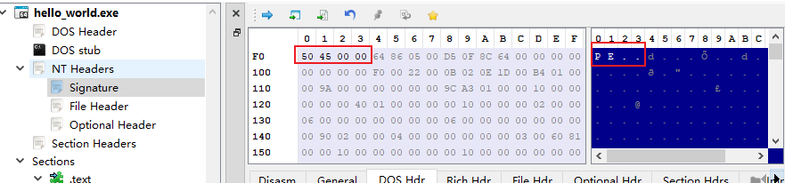

* 接下来判断一下PE文件的类型，主要是通过`NT Headers`的`Optional Header`进行识别：
  * `Optional Header`：
    * 主要看Magic字段（两个字节）：`0x10b ==> NT32`，`0x20b ==> NT64`
    * 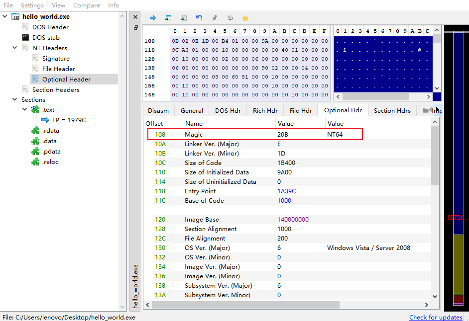

---

* 代码：

```cpp
int pe_validate(FILE* file) {
	/*  
	*  此函数用于检查传入文件是否为PE文件
	*  参数1是传入的PE文件FILE指针
	*  返回值：-1表示文件损坏（针对PE文件来说）；0表示不是合法的PE文件；否则返回PE文件的类型（32 -> PE32; 64 -> PE+/PE32+; 1 -> ROM?）
	*/

	__IMAGE_DOS_HEADER dos_header;
	DWORD sig;
	WORD pefile_type;

	fseek(file, 0, SEEK_SET);
	size_t read_size = fread(&dos_header, sizeof(__IMAGE_DOS_HEADER), 1, file);

	if (read_size != 1)
		return -1;

	// 检查PE文件的MS标志
	if (dos_header.e_magic != ___IMAGE_DOS_SIGNATURE) {
		fprintf(stderr, "Not a PE file.\n");
		return 0;
	}

	// 检查NT Header的PE标志
	if (fseek(file, dos_header.e_lfanew, SEEK_SET)) return -1;
	fread(&sig, sizeof(DWORD), 1, file);
	if (sig != ___IMAGE_NT_SIGNATURE) {
		fprintf(stderr, "Not a PE file.\n");
		return 0;
	}

	if (fseek(file, dos_header.e_lfanew + sizeof(DWORD) + sizeof(___IMAGE_FILE_HEADER), SEEK_SET)) return -1;
	read_size = fread(&pefile_type, sizeof(WORD), 1, file);

	if (read_size != 1) return -1;
	// 匹配PE文件的类型
	switch (pefile_type) {
		case ___IMAGE_NT_OPTIONAL_HDR32_MAGIC:
			return 32;
		case ___IMAGE_NT_OPTIONAL_HDR64_MAGIC:
			return 64;
		case ___IMAGE_ROM_OPTIONAL_HDR_MAGIC:
			return 1;
		default: {
			fprintf(stderr, "Error when parsing ___IMAGE_OPTIONAL_HEADER.Magic. Unknown Type.\n");
			return 0;
		}
	}

	return -1;
}
```

* 测试：

```cpp
int main()
{
    FILE* fp;
    fopen_s(&fp, "PATH_TO_PE_FILE", "r");
    std::cout << pe_validate(fp) << '\n';
}
```

输出结果为64，表示该PE文件类型为`PE32+`

## Step 2: 解析PE32文件头

* `PE32`和`PE32+`仅在位长上存在差异，整体处理逻辑是无任何区别的；

* `PE32`文件主要包括的结构有：
  * `DOS header`
  * `DOS Stub (Rich Header)`
  * `NT Headers (File Header、Optional Header)`
  * `Section Headers`
  * ...（请注意，我们这里仅仅是设计一个简单的解析器，解析的功能可能并不完善，仅用于加深对PE文件格式的理解）

* `PE32`文件结构类的设计：

```cpp
class PE32 {
public:
	PE32(char*, FILE*);

	void print_info();

private:
	// 基础的成员变量
	char* file_path;
	FILE* pe_fp;

	// PE相关头
	___IMAGE_DOS_HEADER         pe_dos_header;
	___IMAGE_NT_HEADERS32       pe_nt_headers_32;
	___PIMAGE_OPTIONAL_HEADER32 nt_optional_headers;
	___PIMAGE_SECTION_HEADER    section_headers;
	___PIMAGE_IMPORT_DESCRIPTOR import_dir_table_entries;
	___IMAGE_EXPORT_DIRECTORY   export_dir_table;
	___PIMAGE_BASE_RELOCATION   basereloc_table;
	___IMAGE_RESOURCE_DIRECTORY resource_dir_root;

	// PE相关头中的偏移量和变量
	WORD  nt_headers_machine;
	LONG  nt_headers_offset;
	WORD  nt_sections_cnt;
	WORD  nt_optional_header_size;
	WORD  nt_characteristics;
	DWORD pe_header_size;
	DWORD import_dir_table_rva;
	DWORD import_dir_table_size;
	DWORD export_dir_table_rva;
	DWORD export_dir_table_size;
	DWORD basereloc_dir_table_rva;
	DWORD basereloc_dir_table_size;
	DWORD resource_dir_table_rva;
	DWORD resource_dir_table_size;

	// 辅助变量
	DWORD import_dir_table_entries_num;
	DWORD basereloc_table_num;

	// 与Rich headers有关的相关变量
	RICH_HEADER rich_headers;

	// 辅助函数，用于转化相关地址
	DWORD va_to_raw(DWORD);

	// 解析相关的函数
	void parse_file();
	void parse_dos_header();
	void parse_dos_stub();
	void parse_nt_headers();
	void parse_section_headers();
	void parse_import_directory();
	void parse_export_directory();
	void parse_basereloc_table();
	void parse_resources_table();

	// 打印相关的函数
	void print_file_info();
	void print_dos_header_info();
	void print_dos_stub_info();
	void print_nt_headers_info();
	void print_section_headers_info();
	void print_import_table_info();
	void print_export_table_info();
	void print_basereloc_table_info();
	void print_resources_table_info();

};
```

### Step 2.1: 解析DOS Header

* 在类中维护一个`IMAGE_DOS_HEADER`的变量`pe_dos_header`，然后从文件中将相应数据读入到该成员变量即可。同时我们这里在类中维护了一个`nt_headers_offset`的成员变量，用于记录`NT Headers`的偏移值。
* 代码：

```c
void PE32::parse_dos_header()
{
	
	fseek(pe_fp, 0, SEEK_SET);
	fread(&pe_dos_header, sizeof(___IMAGE_DOS_HEADER), 1, pe_fp);
	// 这里不需要检查读入字节数，因为之前已经调用过 `pe_validate()` 了，
	// 因此这里一定能够读入 `sizeof(___IMAGE_DOS_HEADER)` 个字节

}

void PE32::print_dos_header_info()
{
	nt_headers_offset = pe_dos_header.e_lfanew;

	// 为了简化，我们这里只打印一些主要信息
	fprintf(stdout, "======DOS Header======\n\n");
	fprintf(stdout, "Magic number: %04X\n", pe_dos_header.e_magic);
	fprintf(stdout, "File address of new exe header: %X\n", pe_dos_header.e_lfanew);
	fprintf(stdout, "\n==========END==========\n");

}
```

* 运行结果：

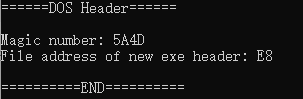

---

### Step 2.2: 解析DOS Stub（Rich headers）

* 这一部分主要解析`DOS Stub`中的`Rich headers`。请注意，暂无文档说明过`Rich headers`是包含在`DOS Stub`内的，但`Rich headers`所处的位置确实介于`PE`头和`DOS`头之间的，因此本文不严谨的将`Rich headers`包含在`DOS Stub`内部

* 什么是`Rich headers`？

  * `Rich headers`可以理解为存储着开发环境信息的一段指纹[10]，或用于帮助诊断和调试
  * `Rich headers`使用`XOR Key`对`Rich headers`中的每4个字节进行了异或加密
  * `Rich headers`的结构如下图所示：

  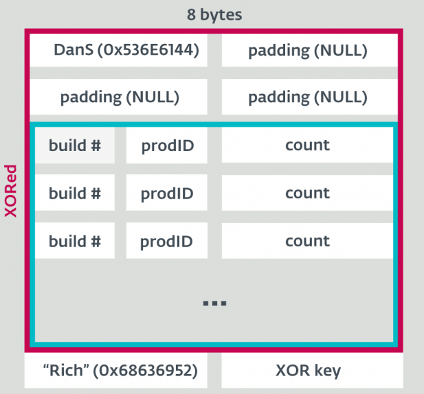

* 如何定位`Rich headers`？
  * 首先，`Rich headers`肯定是以四个字节的`Rich`（`0x68636952`），并且后面还跟着四个字节的`XOR key`；
  * 然后，为了确定`Rich headers`的长度，我们向前搜索，并根据`XOR`密钥异或恢复原数据，并找到`DanS ID`（`0x536e6144`），这样一来我们就找到了`Rich headers`的起始位置；
  * 最后，我们使用`XOR`密钥解密`Rich headers`的内容并恢复原数据。

* 设计结构体用来存储`Rich headers`数据：

```cpp
typedef struct __RICH_HEADER_DATA {
	int   data_size;
	char* data_ptr;
}RICH_HEADER_DATA;

typedef struct __RICH_HEADER_ENTRY {
	// Build ID
	// Product ID
	// Count
	WORD  r_build_id;
	WORD  r_prod_id;
	DWORD r_count;

}RICH_HEADER_ENTRY, *PRICH_HEADER_ENTRY;

typedef struct __RICH_HEADER {
	RICH_HEADER_DATA   raw_data;
	PRICH_HEADER_ENTRY entries;  // pointer
	int                entries_num;
	bool			   exits;	 // 这里我们使用了一个bool型变量表示是否存在该Header
}RICH_HEADER, * PRICH_HEADER;
```

* 处理逻辑代码：

```cpp
void PE32::parse_dos_stub()
{
	size_t alloc_size;
	char* dos_stub_buffer, * buf_ptr;
	int i, start, end;
	DWORD xor_key = 0;

	memset(&rich_headers, 0, sizeof(RICH_HEADER));

	// 防止malloc_size_too_big问题
	alloc_size = nt_headers_offset - sizeof(__IMAGE_DOS_HEADER);
	if (alloc_size + 1 > 0xffffff) {
		// Really too big! Reject this allocation!
		exit(-1);
	}

	// 解析Rich headers
	dos_stub_buffer = (char*)malloc(alloc_size + 1);
	if (!dos_stub_buffer) {
		fprintf(stderr, "Error: Dos_stub_buffer malloc failed\n");
		exit(-1);
	}
	fseek(pe_fp, sizeof(__IMAGE_DOS_HEADER) - 1, SEEK_SET);
	fread(dos_stub_buffer, sizeof(char), alloc_size, pe_fp);
	dos_stub_buffer[alloc_size] = 0;

	// 从后往前寻找 `Rich` 标志
	// 理论上这里的Rich headers是对齐到4字节的
	/*
	for (i = alloc_size - 4; i >= 0; i -= 4) {
		if (*(DWORD*)(dos_stub_buffer + i) == ___IMAGE_RICH_ID) {
			// 找到 `Rich`
			xor_key = *(DWORD*)(dos_stub_buffer + i + 4);
			fprintf(stdout, "%x\n", xor_key);
		}
	}
	*/

	for (i = alloc_size - 4; i >= 0; i--) {
		if (dos_stub_buffer[i] == 'R' &&
			dos_stub_buffer[i + 1] == 'i' &&
			dos_stub_buffer[i + 2] == 'c' &&
			dos_stub_buffer[i + 3] == 'h') {
			// 找到 `Rich`
			if (i + 8 >= (int)alloc_size) {
				// 处理潜在的越界读问题
				fprintf(stderr, "Detect out bound read. Bad PE file!\n");
				exit(-1);
			}
			xor_key = *(DWORD*)(dos_stub_buffer + i + 4);
			break;
		}
	}
	if (i < 0) {
		// 该PE文件可能经过修改调整，Rich headers可能被删除了
		// 也有可能该PE文件格式有误
		fprintf(stdout, "Warning: Cannot find Rich headers. (Ignore)\n");
		rich_headers.exits = false;
		return;
	}

	end = i + 8;

	// 寻找起始点
	for (i = end - 8; i >= 0; i -= 4) {
		DWORD* temp = (DWORD*)&dos_stub_buffer[i];
		if ((*temp ^ xor_key) == ___IMAGE_RICH_DANS_ID)
			break;
	}
	if (i < 0) {
		fprintf(stderr, "Error: Bad PE file!\n");
		exit(-1);
	}

	start = i;

	alloc_size = end - start;
	rich_headers.raw_data.data_ptr = (char*)malloc(alloc_size);
	if (!rich_headers.raw_data.data_ptr) {
		fprintf(stderr, "Error: Data_ptr malloc failed!\n");
		exit(-1);
	}
	rich_headers.raw_data.data_size = alloc_size;
	memcpy(rich_headers.raw_data.data_ptr, dos_stub_buffer + start, alloc_size);
	free(dos_stub_buffer);

	// 删除首部"DanS + 3padding"和尾部"Rich + XOR key"
	if((alloc_size - 24) % 8 == 0 && (alloc_size - 24) / 8 <= 0xffff)  // 限制一下最大rich header数
		rich_headers.entries_num = (alloc_size - 24) / 8;
	else {
		fprintf(stderr, "Error: Bad PE file!\n");
		exit(-1);
	}

	// 解析头部实体
	rich_headers.entries = (PRICH_HEADER_ENTRY)malloc(sizeof(RICH_HEADER_ENTRY) * rich_headers.entries_num);
	if (!rich_headers.entries) {
		fprintf(stderr, "Error: Rich_headers.entries malloc failed!\n");
		exit(-1);
	}

	buf_ptr = rich_headers.raw_data.data_ptr + 16;
	for (i = 0; i < rich_headers.entries_num; i++) {

		DWORD* temp = (DWORD*)buf_ptr;
		rich_headers.entries[i].r_prod_id = (*temp >> 16) ^ (xor_key >> 16);
		rich_headers.entries[i].r_build_id = (*temp & 0x0000ffff) ^ (xor_key & 0x0000ffff);
		temp++;
		rich_headers.entries[i].r_count = *temp ^ xor_key;
		buf_ptr += 8;

	}
	
    rich_headers.exits = true;
    
	// 酌情删除raw_data缓存的rich_headers原始数据
	free(rich_headers.raw_data.data_ptr);

}

void PE32::print_dos_stub_info()
{	
	// 打印Rich headers的信息
	fprintf(stdout, "=====Rich Headers=====\n\n");
	fprintf(stdout, "%-25s\tBuildID\t\tCount\t\tMeaning\n", "ProductName");
	for (int i = 0; i < rich_headers.entries_num; i++) {
		fprintf(stdout, "%-25s\t%d\t\t%d\t\t%d.%d.%d\n",
			prod_ids_to_names[rich_headers.entries[i].r_prod_id],
			rich_headers.entries[i].r_prod_id,
			rich_headers.entries[i].r_count,
			rich_headers.entries[i].r_build_id,
			rich_headers.entries[i].r_prod_id,
			rich_headers.entries[i].r_count
		);
	}
	fprintf(stdout, "\n==========END==========\n\n");

}
```

* 运行结果：

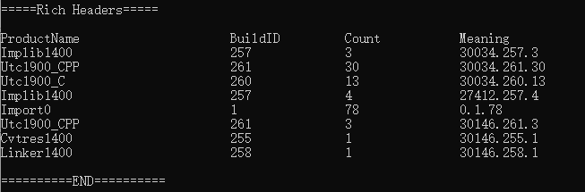

---

### Step 2.3: 解析NT Headers

* `NT Headers`包含三个部分，分别是 `PE Signature` 、`File Header` 和 `Optional Header`
  * `PE Signature`：没有啥玩意，就是四个字节0x4550（PE..），用来表示PE头
  * `File Header`：记录文件的一些信息，如计算机体系结构类型、节区数量、时间戳、`Optional Header`大小、PE文件属性等等
  * `Optional Header`：可选头，包含一些程序执行的重要信息，如程序执行入口地址、程序首选装载地址、内存中节区对齐大小、文件中节区对齐大小、镜像大小、PE头大小等等

* 解析流程：
  * 按照相关结构体的信息依次解析即可

* 处理逻辑代码：

```cpp
void PE32::parse_nt_headers()
{
	size_t read_size;

	fseek(pe_fp, nt_headers_offset, SEEK_SET);
	read_size = fread(&pe_nt_headers_32, sizeof(___IMAGE_NT_HEADERS32), 1, pe_fp);

	if (read_size != 1) {
		fprintf(stderr, "Error: Bad PE file!\n");
		exit(-1);
	}

	nt_sections_cnt = pe_nt_headers_32.FileHeader.NumberOfSections;
	nt_optional_header_size = pe_nt_headers_32.FileHeader.SizeOfOptionalHeader;
	nt_characteristics = pe_nt_headers_32.FileHeader.Characteristics;
	nt_optional_headers = &pe_nt_headers_32.OptionalHeader;
	pe_header_size = nt_optional_headers->SizeOfHeaders;
	import_dir_table_rva = nt_optional_headers->DataDirectory[___IMAGE_DIRECTORY_ENTRY_IMPORT].VirtualAddress;
	import_dir_table_size = nt_optional_headers->DataDirectory[___IMAGE_DIRECTORY_ENTRY_IMPORT].Size;
	export_dir_table_rva = nt_optional_headers->DataDirectory[___IMAGE_DIRECTORY_ENTRY_EXPORT].VirtualAddress;
	export_dir_table_size = nt_optional_headers->DataDirectory[___IMAGE_DIRECTORY_ENTRY_EXPORT].Size;
	basereloc_dir_table_rva = nt_optional_headers->DataDirectory[___IMAGE_DIRECTORY_ENTRY_BASERELOC].VirtualAddress;
	basereloc_dir_table_size = nt_optional_headers->DataDirectory[___IMAGE_DIRECTORY_ENTRY_BASERELOC].Size;
	resource_dir_table_rva = nt_optional_headers->DataDirectory[___IMAGE_DIRECTORY_ENTRY_RESOURCE].VirtualAddress;
	resource_dir_table_size = nt_optional_headers->DataDirectory[___IMAGE_DIRECTORY_ENTRY_RESOURCE].Size;

}

void PE32::print_nt_headers_info()
{
	WORD temp_c, n, i;

	fprintf(stdout, "======NT Headers======\n\n");

	fprintf(stdout, "PE Signature: 0x%X\n\n", pe_nt_headers_32.Signature);

	fprintf(stdout, "File Header:\n");
	fprintf(stdout, " - Machine: %s (0x%04X)\n", 
		translate_machine(pe_nt_headers_32.FileHeader.Machine),
		pe_nt_headers_32.FileHeader.Machine);
	fprintf(stdout, " - Sections Count: %d\n", nt_sections_cnt);
	// fprintf(stdout, " - Time Date Stamp: %d\n", pe_nt_headers_32.FileHeader.TimeDateStamp);
	fprintf(stdout, " - Size of Optional Header: %d\n", nt_optional_header_size);
	fprintf(stdout, " - Characteristics: 0x%X\n", nt_characteristics);
	// 进一步解析Characteritics
	temp_c = nt_characteristics;
	n = 0;
	while (temp_c) {
		if (temp_c & 1) {
			fprintf(stdout, "    - 0x%X:\t %s\n", (1 << n), characteristics_names[n]);
		}
		temp_c = temp_c >> 1;
		n++;
	}

	fprintf(stdout, "\nOptional Header:\n");
	fprintf(stdout, " - Magic: %s (0x%X)\n", translate_nt_optional_header_magic(nt_optional_headers->Magic), nt_optional_headers->Magic);
	fprintf(stdout, " - Size of Code: 0x%X (%d)\n", nt_optional_headers->SizeOfCode, nt_optional_headers->SizeOfCode);
	fprintf(stdout, " - Size of Initialized Data: 0x%X (%d)\n", nt_optional_headers->SizeOfInitializedData, nt_optional_headers->SizeOfInitializedData);
	fprintf(stdout, " - Size of Uninitialized Data: 0x%X (%d)\n", nt_optional_headers->SizeOfUninitializedData, nt_optional_headers->SizeOfUninitializedData);
	fprintf(stdout, " - Entry Point: 0x%X (%d)\n", nt_optional_headers->AddressOfEntryPoint, nt_optional_headers->AddressOfEntryPoint);
	fprintf(stdout, " - Base of Code: 0x%X\n", nt_optional_headers->BaseOfCode);
	fprintf(stdout, " - Desired Image Base: 0x%X\n", nt_optional_headers->ImageBase);
	fprintf(stdout, " - Section Alignment: 0x%X\n", nt_optional_headers->SectionAlignment);
	fprintf(stdout, " - File Alignment: 0x%X\n", nt_optional_headers->FileAlignment);
	fprintf(stdout, " - Size of Image: 0x%X (%d)\n", nt_optional_headers->SizeOfImage, nt_optional_headers->SizeOfImage);
	fprintf(stdout, " - Size of Headers: 0x%X (%d)\n", nt_optional_headers->SizeOfHeaders, nt_optional_headers->SizeOfHeaders);

	fprintf(stdout, " - Data Directory:\n");
	for (i = 0; i < ___IMAGE_DIRECTORY_ENTRY_COM_DESCRIPTOR; i++) {
		fprintf(stdout, "    - %s ==> Address: 0x%X, Size: 0x%X\n", translate_data_directory(i), nt_optional_headers->DataDirectory[i].VirtualAddress, nt_optional_headers->DataDirectory[i].Size);
	}

	fprintf(stdout, "\n==========END=========\n\n");

}
```

* 运行结果：

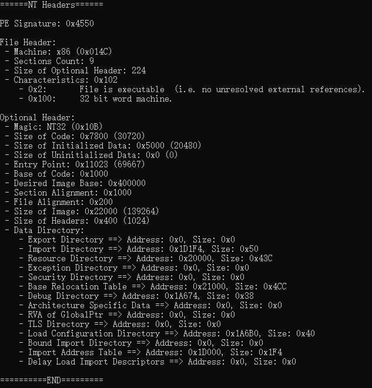

---

### Step 2.4: 解析Section Headers

* `Section Headers`：存储着与节区相关的信息，包括节区名、`VirtualAddress`、`VirtualSize`、`PointerToRawData`、`SizeOfRawData`、`Characteristics`等
  * `VirtualAddress`：该节区载入内存中的偏移地址[11]；
  * `VirtualSize`：该节区在内存中的大小（内存对齐之前的长度：真实长度）[11]；
  * `PointerToRawData`：该节区在文件中的偏移地址[11]；
  * `SizeOfRawData`：该节区在文件中的大小（文件对齐之前的长度：真实长度）[11]；
  * `Characteristics`：用来表征该节区的一些属性，具体值详见[PE Format - Win32 apps | Microsoft Learn](https://learn.microsoft.com/en-us/windows/win32/debug/pe-format#section-flags)

* 解析流程：
  * `Section Headers`在`NT Headers`之后，而`NT Headers`的值是固定的，可以通过`nt_headers_offset`偏移地址加上`NT Headers`的长度找到`Section Headers`在文件中的偏移地址；
  * `Section Headers`中section数量由`NT Headers - FileHeader`中的`NumberOfSections`字段决定，因此可以通过该字段确定Section的数量；
  * 按照`___IMAGE_SECTION_HEADER`结构体依次解析`NumberOfSections`个Section即可

* 处理逻辑代码：

```cpp
void PE32::parse_section_headers()
{
	size_t read_size;

	// 检查一下边界
	int start_pos = nt_headers_offset + sizeof(___IMAGE_NT_HEADERS32);
	if (start_pos + nt_sections_cnt * sizeof(___IMAGE_SECTION_HEADER) > pe_header_size) {
		fprintf(stderr, "Error: Out of PE header's size. Bad PE file!\n");
		exit(-1);
	}

	// section_headers为指针变量，需要动态分配空间
	section_headers = (___PIMAGE_SECTION_HEADER)malloc(sizeof(___IMAGE_SECTION_HEADER) * nt_sections_cnt);
	if (!section_headers) {
		fprintf(stderr, "Error: Section_headers malloc failed!\n");
		exit(-1);
	}

	fseek(pe_fp, start_pos, SEEK_SET);
	read_size = fread(section_headers, sizeof(___IMAGE_SECTION_HEADER), nt_sections_cnt, pe_fp);
	
	if (read_size != nt_sections_cnt) {
		fprintf(stderr, "Error: Bad PE file!\n");
		exit(-1);
	}

}

void PE32::print_section_headers_info()
{

	int i;

	fprintf(stdout, "====Section Headers===\n");
	fprintf(stdout, "Number of Sections: %d\n\n", nt_sections_cnt);

	for (i = 0; i < nt_sections_cnt; i++) {

		BYTE* section_name = (BYTE*)malloc(___IMAGE_SIZEOF_SHORT_NAME + 1);
		if (!section_name) {
			fprintf(stderr, "Error: Section_name malloc failed!\n");
			exit(-1);
		}
		section_name[___IMAGE_SIZEOF_SHORT_NAME] = 0;
		memcpy(section_name, section_headers[i].Name, ___IMAGE_SIZEOF_SHORT_NAME);

		fprintf(stdout, "  * %s:\n", section_name);
		fprintf(stdout, "    - Virtual Address: 0x%X\n", section_headers[i].VirtualAddress);
		// virtual size 是该节区装在到内存的总大小，如果值大于SizeOfRawData则多出的部分用0x00填充
		fprintf(stdout, "    - Virtual Size: 0x%X\n", section_headers[i].Misc.VirtualSize);
		fprintf(stdout, "    - Pointer to Raw Data: 0x%X\n", section_headers[i].PointerToRawData);
		fprintf(stdout, "    - Raw Data's Size: 0x%X\n", section_headers[i].SizeOfRawData);
		fprintf(stdout, "    - Characteristics: 0x%X\n\n", section_headers[i].Characteristics);

	}

	fprintf(stdout, "\n==========END=========\n\n");

}
```

* 运行结果：

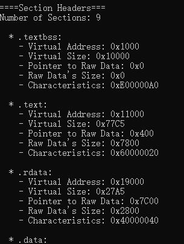

---

### 本节小结

* 本节主要解析了PE32文件的头部信息，包括`DOS Header`、`Rish Headers`、`NT Headers`和`Section Headers`，并通过这种解析的过程了解了PE文件的结构，如下图所示：


* 此外还剩下需要具体分析的是Section信息，我们将在下一节中详细介绍

## Step 3: 解析Sections

* PE文件的Sections包括[12]：

| Section Name | Content                                                      | Characteristics                                              |
| :----------- | :----------------------------------------------------------- | :----------------------------------------------------------- |
| .bss         | 未初始化数据(free format)                                    | IMAGE_SCN_CNT_UNINITIALIZED_DATA \| IMAGE_SCN_MEM_READ \| IMAGE_SCN_MEM_WRITE |
| .cormeta     | CLR metadata that indicates that the object file contains managed code | IMAGE_SCN_LNK_INFO                                           |
| .data        | 已初始化数据(free format)                                    | IMAGE_SCN_CNT_INITIALIZED_DATA \| IMAGE_SCN_MEM_READ \| IMAGE_SCN_MEM_WRITE |
| .debug$F     | Generated FPO debug information (object only, x86 architecture only, and now obsolete) | IMAGE_SCN_CNT_INITIALIZED_DATA \| IMAGE_SCN_MEM_READ \| IMAGE_SCN_MEM_DISCARDABLE |
| .debug$P     | Precompiled debug types (object only)                        | IMAGE_SCN_CNT_INITIALIZED_DATA \| IMAGE_SCN_MEM_READ \| IMAGE_SCN_MEM_DISCARDABLE |
| .debug$S     | Debug symbols (object only)                                  | IMAGE_SCN_CNT_INITIALIZED_DATA \| IMAGE_SCN_MEM_READ \| IMAGE_SCN_MEM_DISCARDABLE |
| .debug$T     | Debug types (object only)                                    | IMAGE_SCN_CNT_INITIALIZED_DATA \| IMAGE_SCN_MEM_READ \| IMAGE_SCN_MEM_DISCARDABLE |
| .drective    | Linker options                                               | IMAGE_SCN_LNK_INFO                                           |
| .edata       | 导出表                                                       | IMAGE_SCN_CNT_INITIALIZED_DATA \| IMAGE_SCN_MEM_READ         |
| .idata       | 导入表                                                       | IMAGE_SCN_CNT_INITIALIZED_DATA \| IMAGE_SCN_MEM_READ \| IMAGE_SCN_MEM_WRITE |
| .idlsym      | Includes registered SEH (image only) to support IDL attributes. For information, see "IDL Attributes" in [References](https://learn.microsoft.com/en-us/windows/win32/debug/pe-format#references) at the end of this topic. | IMAGE_SCN_LNK_INFO                                           |
| .pdata       | 异常信息                                                     | IMAGE_SCN_CNT_INITIALIZED_DATA \| IMAGE_SCN_MEM_READ         |
| .rdata       | 只读的已初始化数据                                           | IMAGE_SCN_CNT_INITIALIZED_DATA \| IMAGE_SCN_MEM_READ         |
| .reloc       | 镜像重定向                                                   | IMAGE_SCN_CNT_INITIALIZED_DATA \| IMAGE_SCN_MEM_READ \| IMAGE_SCN_MEM_DISCARDABLE |
| .rsrc        | 资源目录                                                     | IMAGE_SCN_CNT_INITIALIZED_DATA \| IMAGE_SCN_MEM_READ         |
| .sbss        | GP-relative uninitialized data (free format)                 | IMAGE_SCN_CNT_UNINITIALIZED_DATA \| IMAGE_SCN_MEM_READ \| IMAGE_SCN_MEM_WRITE \| IMAGE _SCN_GPREL The IMAGE_SCN_GPREL flag should be set for IA64 architectures only; this flag is not valid for other architectures. The IMAGE_SCN_GPREL flag is for object files only; when this section type appears in an image file, the IMAGE_SCN_GPREL flag must not be set. |
| .sdata       | GP-relative initialized data (free format)                   | IMAGE_SCN_CNT_INITIALIZED_DATA \| IMAGE_SCN_MEM_READ \| IMAGE_SCN_MEM_WRITE \| IMAGE _SCN_GPREL The IMAGE_SCN_GPREL flag should be set for IA64 architectures only; this flag is not valid for other architectures. The IMAGE_SCN_GPREL flag is for object files only; when this section type appears in an image file, the IMAGE_SCN_GPREL flag must not be set. |
| .srdata      | GP-relative read-only data (free format)                     | IMAGE_SCN_CNT_INITIALIZED_DATA \| IMAGE_SCN_MEM_READ \| IMAGE _SCN_GPREL The IMAGE_SCN_GPREL flag should be set for IA64 architectures only; this flag is not valid for other architectures. The IMAGE_SCN_GPREL flag is for object files only; when this section type appears in an image file, the IMAGE_SCN_GPREL flag must not be set. |
| .sxdata      | Registered exception handler data (free format and x86/object only) | IMAGE_SCN_LNK_INFO Contains the symbol index of each of the exception handlers being referred to by the code in that object file. The symbol can be for an UNDEF symbol or one that is defined in that module. |
| .text        | 可执行汇编码 (free format)                                   | IMAGE_SCN_CNT_CODE \| IMAGE_SCN_MEM_EXECUTE \| IIMAGE_SCN_MEM_READ |
| .tls         | 线程局部存储(object only)                                    | IMAGE_SCN_CNT_INITIALIZED_DATA \| IMAGE_SCN_MEM_READ \| IMAGE_SCN_MEM_WRITE |
| .tls$        | Thread-local storage (object only)                           | IMAGE_SCN_CNT_INITIALIZED_DATA \| IMAGE_SCN_MEM_READ \| IMAGE_SCN_MEM_WRITE |
| .vsdata      | GP-relative initialized data (free format and for ARM, SH4, and Thumb architectures only) | IMAGE_SCN_CNT_INITIALIZED_DATA \| IMAGE_SCN_MEM_READ \| IMAGE_SCN_MEM_WRITE |
| .xdata       | Exception information (free format)                          | IMAGE_SCN_CNT_INITIALIZED_DATA \| IMAGE_SCN_MEM_READ         |

* 接下来我们将解析Sections中比较重要的几个Section的数据

### Step 3.1: 解析PE导入表（.idata）

* `.idata`节存储着所有的导入符号，其包含下面几个内容[13]：

  * **导入目录表**

    Null 目录条目

  * DLL1 导入查找表

    Null

  * DLL2 导入查找表

    Null

  * DLL3 导入查找表

    Null

  * 提示/名称表

---

**1. 导入目录表**

* 导入目录表的每一个字段的含义：

| 偏移 | 大小 | 字段名                                                       | 描述                                                         |
| ---- | ---- | ------------------------------------------------------------ | ------------------------------------------------------------ |
| 0    | 4    | 导入查找表的RVA<br />**Import Lookup Table RVA<br />（Characteristics）** | 导入查找表ILT的RVA，该表包含每一个导入的名字或序号           |
| 4    | 4    | 时间/日期戳<br />**Time/Date Stamp**                         | 在镜像被绑定前该字段设置为0，在绑定之后该字段设置为DLL的时间/日期戳 |
| 8    | 4    | 转发链<br />**Forwarder Chain**                              | 第一个转发器引用的索引                                       |
| 12   | 4    | 名字的RVA<br />**Name RVA**                                  | 包含该DLL名字的ASCII字符串地址，该地址相对于镜像基址         |
| 16   | 4    | 导入地址表RVA<br />**Import Address Table RVA (Thunk Table)** | 导入地址表IAT的RVA，在镜像被绑定之前，该表的内容与导入查找表ILT内容相同 |

**2. 导入查找表ILT**

* 对于PE32来说，该表是一个32位数字的数组；对于PE32+来说，该表是64位数字的数组
* 布局[13]：

| Bit(s) | Size | Bit field           | Description                                                  |
| :----- | :--- | :------------------ | :----------------------------------------------------------- |
| 31/63  | 1    | Ordinal/Name Flag   | If this bit is set, import by ordinal. Otherwise, import by name. Bit is masked as 0x80000000 for PE32, 0x8000000000000000 for PE32+. |
| 15-0   | 16   | Ordinal Number      | A 16-bit ordinal number. This field is used only if the Ordinal/Name Flag bit field is 1 (import by ordinal). Bits 30-15 or 62-15 must be 0. |
| 30-0   | 31   | Hint/Name Table RVA | A 31-bit RVA of a hint/name table entry. This field is used only if the Ordinal/Name Flag bit field is 0 (import by name). For PE32+ bits 62-31 must be zero. |

**3. 提示/名称表：Hint/Name Table**

* 布局[13]：

| 偏移 | 大小   | 字段名 | 描述                 |
| ---- | ------ | ------ | -------------------- |
| 0    | 2      | 提示   | 导出名称指针表的索引 |
| 2    | -      | 名称   | 导入名称ASCII字符串  |
| *    | 0 or 1 | 填充   |                      |

**4. 导入地址表IAT**

* 在镜像被绑定之前，IAT中的结构和内容与ILT相同
* 在镜像被绑定之后，IAT中的实体被重写为需要导入的32位/64位的符号地址，i.e. **该表在运行时会被PE加载器重写**

---

* 解析流程：
  * 在Step 2.3节中，我们解析了`NT Headers`中的`Data Directory`字段，而该字段中就存储了`Import Directory`的相对虚拟地址RVA，我们需要将其转换为文件中的偏移地址
  * RVA --> RAW：
    1. 首先应该遍历所有节区，找到该RVA属于哪一个节区
    2. `Section Headers`记录了各个Section的`Virtual Address`和`Pointer to Raw Data`，该地址**在文件中的偏移RAW = RVA - Section's Virtual Address + Pointer to Raw Data**（我们将该功能封装到一个函数中）
    3. 读取并解析RAW中的数据
  * 举例：我们假设导入目录表的RVA为0x1D1F4，`.idata`的`Virtual Address`为 0x1D000且大小为0xBE7，因此该RVA在`.idata`段内；然后，我们根据`.idata`的`Pointer to Raw Data`值0xA800，找到该导入目录表在文件中的偏移值为0xA800+（0x1D1F4-0x1D000）= **0xA9F4**
  * 导入目录表实体数可以由`Import Directory`的大小除以20字节得到，请注意最后一个实体为全0填充

* 处理代码：

```cpp
void PE32::parse_import_directory()
{

	DWORD raw_offset, entry_num, read_size;

	// 先检查import_dir_table_size的合法性，拒绝非法PE文件
	if (import_dir_table_size % sizeof(___IMAGE_IMPORT_DESCRIPTOR) != 0) {
		fprintf(stderr, "Error: Wrong Import Directory size. Bad PE file!\n");
		exit(-1);
	}

	entry_num = import_dir_table_size / sizeof(___IMAGE_IMPORT_DESCRIPTOR);
	// 这里需要注意一下，导入目录表最后一个实体为全0填充
	// 这里其实没必要读取最后一个实体的内容
	entry_num = entry_num - 1;

	if (entry_num > 0xffff) {
		fprintf(stderr, "Error: Too many import entries!");
		exit(-1);
	}

	raw_offset = va_to_raw(import_dir_table_rva);
	fseek(pe_fp, raw_offset, SEEK_SET);

	import_dir_table_entries = (___PIMAGE_IMPORT_DESCRIPTOR)malloc(sizeof(___IMAGE_IMPORT_DESCRIPTOR) * entry_num);
	if (!import_dir_table_entries) {
		fprintf(stderr, "Error: Import_dir_table malloc failed!\n");
		exit(-1);
	}
	read_size = fread(import_dir_table_entries, sizeof(___IMAGE_IMPORT_DESCRIPTOR), entry_num, pe_fp);

	if (read_size != entry_num) {
		fprintf(stderr, "Error: Bad PE file!\n");
		exit(-1);
	}

	import_dir_table_entries_num = entry_num;

}

void PE32::print_import_table_info()
{

	DWORD i, j, name_size, name_rva;
	char* name_tmp, ch = 1;
	___IMAGE_IMPORT_BY_NAME hint;

	fprintf(stdout, "======Import table====\n\n");

	for (i = 0; i < import_dir_table_entries_num; i++) {

		name_rva = import_dir_table_entries[i].Name;
		fseek(pe_fp, va_to_raw(name_rva), SEEK_SET);
		
		// 确定名字的长度
		name_size = 0;
		ch = fgetc(pe_fp);
		while (ch != EOF && ch != 0) {
			if (++name_size > 256) { 
				// 拒绝名称大于256的DLL名字（对非法PE的检查）
				fprintf(stderr, "Error: DLL's name too long?!\n");
				exit(-1);
			}
			ch = fgetc(pe_fp);
		}
		
		name_tmp = (char*)malloc(name_size + 1);
		if (!name_tmp) {
			fprintf(stderr, "Error: Name_tmp malloc failed!\n");
			exit(-1);
		}
		name_tmp[name_size] = 0;
		fseek(pe_fp, va_to_raw(name_rva), SEEK_SET);
		fread(name_tmp, sizeof(char), name_size, pe_fp);
		fprintf(stdout, "  * %s:\n\n", name_tmp);
		free(name_tmp);
		fprintf(stdout, "    - Import Lookup Table (ILT): 0x%X (RVA), 0x%X (RAW)\n",
			import_dir_table_entries[i].DUMMYUNIONNAME.OriginalFirstThunk,
			va_to_raw(import_dir_table_entries[i].DUMMYUNIONNAME.OriginalFirstThunk));
		fprintf(stdout, "    - Import Address Table (IAT): 0x%X (RVA), 0x%X (RAW)\n",
			import_dir_table_entries[i].FirstThunk,
			va_to_raw(import_dir_table_entries[i].FirstThunk));
		fprintf(stdout, "    - Bound?: %s\n", import_dir_table_entries[i].TimeDateStamp ? "TRUE" : "FALSE");


		// ILT和IAT值在PE加载前是一样的，随便读取哪一个都行
		// 解析具体函数名
	    // https://learn.microsoft.com/zh-cn/windows/win32/debug/pe-format#the-idata-section

		fprintf(stdout, "    - Entries: \n\n");

		for (j = 0; ; j++) {
			fseek(pe_fp, va_to_raw(import_dir_table_entries[i].FirstThunk + j * sizeof(DWORD)), SEEK_SET);
			fread(&name_rva, sizeof(DWORD), 1, pe_fp);
			if (name_rva == 0) break;
			if (!(name_rva & 0x80000000)) {
				fseek(pe_fp, va_to_raw(name_rva), SEEK_SET);
				fread(&hint, sizeof(___IMAGE_IMPORT_BY_NAME), 1, pe_fp);
				hint.Name[99] = 0; // 防止越界读
				fprintf(stdout, "       [%02d] Name: %s\n            Hint: 0x%X\n            Call via: 0x%X (RVA)\n",
					j + 1, hint.Name, hint.Hint, 
					import_dir_table_entries[i].FirstThunk + j * sizeof(DWORD));
			}
			else {
				// 按照序号导入
				fprintf(stdout, "       [%d] Ordinal: 0x%X\n", j + 1, name_rva & 0xffff);
			}
		}
		fprintf(stdout, "\n");
	}

	fprintf(stdout, "\n==========END=========\n\n");

}
```

* 运行结果：

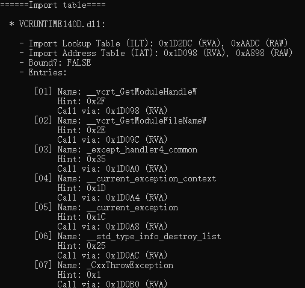

### Step 3.2: 解析PE导出表（.edata）

* `.edata`包含有关其他镜像可以通过动态链接访问的符号信息，通常包含在DLL中[14]。

| 表名称     | 说明                                                         |
| :--------- | :----------------------------------------------------------- |
| 导出目录表 | 只有一行的表（与调试目录不同）。 此表指示其他导出表的位置和大小。 |
| 导出地址表 | 导出符号的 RVA 数组。 这些是可执行代码和数据节中的导出函数和数据的实际地址。 其他映像文件可以使用此表的索引（序号）或者（可选）使用与序号对应的公共名称（如果定义了公共名称）导入符号。 |
| 名称指针表 | 指向公共导出名称的指针数组，按升序排序。                     |
| 序号表     | 对应于名称指针表的成员的序号数组。 对应关系按位置，因此，名称指针表和序号表的成员数必须相同。 每个序号都是导出地址表中的索引。 |
| 导出名称表 | 一系列以 null 结尾的 ASCII 字符串。 名称指针表的成员指向此区域。 这些名称是用于导入和导出符号的公共名称，它们不一定与映像文件中使用的专用名称相同。 |

---

**1. 导出目录表**

* 字段如下所示[14]，其中重要的字段已加粗处理：

| 偏移量 | 大小 | 字段               | 说明                                                         |
| :----- | :--- | :----------------- | :----------------------------------------------------------- |
| 0      | 4    | 导出标志           | 保留，必须为 0。                                             |
| 4      | 4    | 时间/日期戳        | 创建导出数据的时间和日期。                                   |
| 8      | 2    | 主要版本           | 主版本号。 用户可以设置主要版本号和次要版本号。              |
| 10     | 2    | 次要版本           | 次版本号。                                                   |
| 12     | 4    | **名称 RVA**       | 包含 DLL 名称的 ASCII 字符串的地址。 此地址相对于映像基址。  |
| 16     | 4    | **序号基**         | 此映像中的导出的起始序号。 此字段指定导出地址表的起始序号。 **通常设置为 1。** |
| 20     | 4    | **地址表条目**     | 导出地址表中的条目数。                                       |
| 24     | 4    | **名称指针数**     | 名称指针表中的条目数。 也是序号表中的条目数。                |
| 28     | 4    | **导出地址表 RVA** | 导出地址表相对于映像基址的地址。                             |
| 32     | 4    | **名称指针 RVA**   | 导出名称指针表相对于映像基址的地址。 表大小由“名称指针数”字段给出。 |
| 36     | 4    | **序号表RVA**      | 序号表相对于映像基址的地址。                                 |

**2. 导出地址表EAT**

* 可以把EAT理解为一个存放导出地址的RVA数组（4字节为一个RVA），然后根据RVA去找到具体符号的导出地址

| 偏移 | 大小 | 字段       | 说明                                                         |
| :--- | :--- | :--------- | :----------------------------------------------------------- |
| 0    | 4    | 导出RVA    | 加载到内存中时导出符号相对于映像基址的地址。 例如，**导出函数的地址**。 |
| 0    | 4    | 转发器 RVA | 指向导出节中以 null 结尾的 ASCII 字符串的指针。 此字符串必须在导出表数据目录条目给定的范围内。 |

**3. 名称指针RVA**

* 这个也是一个存放名称字符串RVA（4字节）的数组，这个数组是乱序的，如果要恢复其顺序，则需要使用序号表RVA中的信息

**4. 序号表**

* 序号表顺序与名称指针表顺序一致，与导出地址表顺序不一致，需要根据序号表进行恢复。

* 存储符号顺序的表，为**16位**无偏索引数组；这里需要注意的是，真正的（biased）序号等于导出目录表中的序号基 + 该16位无偏值

* 举个例子，序号表第一个16位为03，而相应的名称指针数组第一个RVA所表示的字符串`AboutDlgProc`，序号基为01，那么上述信息可表述为序号04的函数为`AboutDlgProc`，其导出地址为导出地址表中第**4**个值 `9840`。
* 图解整个寻址流程：


---

* 解析流程：

  * 先解析导出目录表，得到导出表的名称指针，并取得其名称；

  * 其次，由于导出表项的序号是乱序的，因此我们构建了一个导出表项的实体用来存储导出表项的内容，如下：

    ```cpp
    typedef struct __EXPORT_ENTRY {
    	WORD  ordinal;
    	DWORD function_rva;
    	DWORD name_rva;
    	char  name[100];
    }EXPORT_ENTRY, *PEXPORT_ENTRY;
    ```

  * 然后，我们根据导出表项的地址表条目数[`NumberOfFunctions`]来创建指定个数的导出表项实体，并根据导出目录表中的名称指针表和序号表的内容找到指定的导出表实体，并更新其字段内容；
  * 最后，将更新后的导出表实体按照ordinal的顺序打印出来

* 处理代码：

```cpp
void PE32::parse_export_directory()
{
	size_t read_size;
	if (!export_dir_table_size || !export_dir_table_rva) return;

	fseek(pe_fp, va_to_raw(export_dir_table_rva), SEEK_SET);
	read_size = fread(&export_dir_table, sizeof(___IMAGE_EXPORT_DIRECTORY), 1, pe_fp);
	if (read_size != 1) {
		fprintf(stderr, "Error: Bad PE file!\n");
		exit(-1);
	}

	// 其他操作就让print函数去完成:))

}

void PE32::print_export_table_info()
{
	size_t read_size;
	DWORD name_offset, name_size, i;
	DWORD* name_p_table, *export_address_table;
	WORD* ord_table;
	char *name_tmp, ch;
	PEXPORT_ENTRY export_entries;

	if (!export_dir_table_size || !export_dir_table_rva) {
		fprintf(stdout, "====No export table===\n\n");
		fprintf(stdout, "\n==========END=========\n\n");
		return;
	}

	fprintf(stdout, "======Export table====\n\n");

	// 先解析导出目录表
	// 1. 先解析导出表名称
	name_offset = va_to_raw(export_dir_table.Name);
	fseek(pe_fp, name_offset, SEEK_SET);
	
	name_size = 0;
	ch = fgetc(pe_fp);
	while (ch != EOF && ch != 0) {
		if (++name_size > 256) {
			fprintf(stderr, "Error: DLL's name too long?!\n");
			exit(-1);
		}
		ch = fgetc(pe_fp);
	}

	name_tmp = (char*)malloc(name_size + 1);
	if (!name_tmp) {
		fprintf(stderr, "Error: Name_tmp malloc failed!\n");
		exit(-1);
	}
	name_tmp[name_size] = 0;
	fseek(pe_fp, name_offset, SEEK_SET);
	fread(name_tmp, sizeof(char), name_size, pe_fp);

	fprintf(stdout, " - Name: %s (raw offset: 0x%X)\n", name_tmp, name_offset);
	free(name_tmp);

	// 2.解析各个导出项
	// 先构造自定义的实体

	if (export_dir_table.NumberOfFunctions < export_dir_table.NumberOfNames) {
		fprintf(stderr, "Error: Seriously?! Bad PE file!\n");
		exit(-1);
	}

	if (export_dir_table.NumberOfFunctions > 0xFFFF) {
		fprintf(stderr, "Error: Too many functions exported (>65535).\n");
		exit(-1);
	}

	export_entries = (PEXPORT_ENTRY)malloc(sizeof(EXPORT_ENTRY) * export_dir_table.NumberOfFunctions);

	// 解析导出地址表
	export_address_table = (DWORD*)malloc(sizeof(DWORD) * export_dir_table.NumberOfFunctions);
	fseek(pe_fp, va_to_raw(export_dir_table.AddressOfFunctions), SEEK_SET);
	read_size = fread(export_address_table, sizeof(DWORD), export_dir_table.NumberOfFunctions, pe_fp);

	if (read_size ^ export_dir_table.NumberOfFunctions) {
		fprintf(stderr, "Error: Bad PE file!\n");
		exit(-1);
	}

	// 初始化
	for (i = 0; i < export_dir_table.NumberOfFunctions; i++) {
		export_entries[i].ordinal = export_dir_table.Base + i;
		export_entries[i].function_rva = export_address_table[i];
		export_entries[i].name_rva = 0;
	}

	free(export_address_table);

	// 解析名称指针表和序号表

	name_p_table = (DWORD*)malloc(sizeof(DWORD) * export_dir_table.NumberOfNames);
	ord_table = (WORD*)malloc(sizeof(WORD) * export_dir_table.NumberOfNames);

	if (!name_p_table || !ord_table) {
		fprintf(stderr, "Error: Name_p_table or ord_table malloc failed!\n");
		exit(-1);
	}

	fseek(pe_fp, va_to_raw(export_dir_table.AddressOfNames), SEEK_SET);
	read_size = fread(name_p_table, sizeof(DWORD), export_dir_table.NumberOfNames, pe_fp);

	fseek(pe_fp, va_to_raw(export_dir_table.AddressOfNameOrdinals), SEEK_SET);
	read_size ^= fread(ord_table, sizeof(WORD), export_dir_table.NumberOfNames, pe_fp);

	if (read_size) {
		fprintf(stderr, "Error: Bad PE file!\n");
		exit(-1);
	}
	
	for (i = 0; i < export_dir_table.NumberOfNames; i++) {

		WORD offset = *(WORD*)(ord_table + i);

		if (offset > export_dir_table.NumberOfFunctions) {
			fprintf(stderr, "Error: Bad PE file!\n");
			exit(-1);
		}

		export_entries[offset].name_rva = *(DWORD*)(name_p_table + i);
		name_offset = va_to_raw(*(DWORD*)(name_p_table + i));
		fseek(pe_fp, name_offset, SEEK_SET);

		name_size = 0;
		ch = fgetc(pe_fp);
		while (ch != EOF && ch != 0) {
			if (++name_size > 99) {
				fprintf(stderr, "Error: Function's name too long?!\n");
				exit(-1);
			}
			ch = fgetc(pe_fp);
		}

		name_tmp = (char*)malloc(name_size + 1);
		if (!name_tmp) {
			fprintf(stderr, "Error: Name_tmp malloc failed!\n");
			exit(-1);
		}
		name_tmp[name_size] = 0;
		fseek(pe_fp, name_offset, SEEK_SET);
		fread(name_tmp, sizeof(char), name_size, pe_fp);

		memcpy(export_entries[offset].name, name_tmp, name_size + 1);
		free(name_tmp);

	}
	
	free(name_p_table);
	free(ord_table);

	// 打印
	fprintf(stdout, " - Export Entries:\n\n");
	for (i = 0; i < export_dir_table.NumberOfFunctions; i++) {
		
		if (!export_entries[i].function_rva)
			memcpy(export_entries[i].name, "-", 2);	
		else
			export_entries[i].name[99] = 0;  // 防止越界读

		fprintf(stdout, "    [%02d] Ordinal: %d\n"
			"           Function RVA: 0x%X\n"
			"           Name: %s (RVA: 0x%X)\n\n",
			i + 1, export_entries[i].ordinal, export_entries[i].function_rva, 
			export_entries[i].name, export_entries[i].name_rva);
	}
	

	free(export_entries);

	fprintf(stdout, "\n==========END=========\n\n");

}
```

* 运行结果：

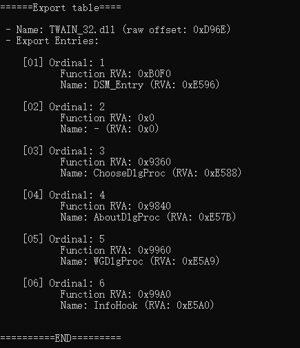

### Step 3.3: 解析重定位表（.reloc）

* 需要重定位表的原因[7]：

  * 在PE程序载入到内存中时，PE Loader会优先按照`ImageBase`（该PE文件渴望的虚拟基地址），但就和人生一样，有时候你想要得到的不一定就能够得到，所以当该`ImageBase`的地址被占用的时候，该PE程序就不能加载到`ImageBase`的虚拟地址

  * `.text`汇编码中包含有一些字符串地址、函数调用地址等，而这些地址都是由编译器根据`ImageBase`预先确定好的，如果PE不能加载到`ImageBase`所指向的虚拟地址时，上述这些地址均需要做修正（i.e. fix up）。

    :chestnut: 举个例子：

    ```assembly
    // 需要重定位的值013EBC98h、013ED49Ch和013E1064h
    printf("Helloworld %s", "hahaha");
    013E64B2 68 98 BC 3E 01       push        offset string "hahaha" (013EBC98h) 
    013E64B7 68 9C D4 3E 01       push        offset string "Helloworld %s" (013ED49Ch) 
    013E64BC E8 A3 AB FF FF       call        _printf (013E1064h) 
    013E64C1 83 C4 08             add         esp,8
    ```

* 重定位表的作用[15]：

  * 修复地址（仅当`ImageBase`地址无法满足时）
    * 如何修复？`fix_up_value = origin_value - ImageBase + new_virtual_address_base`

  :star: 强烈建议阅读[15]这一篇文章，很详细介绍了重定位表的作用！

* PE Section中重定位块[16]

  * 基址重定位块
  * 基址重定位类型

---

**1. 基址重定位块**

* 重定位表

* 布局：

| 偏移 | 大小 | 字段   | 描述                                                         |
| ---- | ---- | ------ | ------------------------------------------------------------ |
| 0    | 4    | 页RVA  | 映像基址和页 RVA 将添加到每个偏移量，以创建必须应用基址重定位的 VA。 |
| 4    | 4    | 块大小 | 映像基址和页 RVA 将添加到每个偏移量，以创建必须应用基址重定位的 VA。 |
| 4    | 2    | 条目1  | 高4位为类型，剩余12位相较于页RVA的偏移量                     |
| 6    | 8    | 条目2  |                                                              |
| ...  | ...  | ...    |                                                              |

**2.基址重定位类型**

| 常数                                | Value | 说明                                                         |
| :---------------------------------- | :---- | :----------------------------------------------------------- |
| IMAGE_REL_BASED_ABSOLUTE            | 0     | 跳过基址重定位。 此类型可用于填充块。                        |
| IMAGE_REL_BASED_HIGH                | 1     | 基址重定位会将差值的高 16 位添加到偏移量的 16 位字段。 16 位字段表示 32 位字的高值。 |
| IMAGE_REL_BASED_LOW                 | 2     | 基址重定位会将差值的低 16 位添加到偏移量为 16 位字段。 16 位字段表示 32 位字的低半部分。 |
| IMAGE_REL_BASED_HIGHLOW             | 3     | 基址重定位会将差值的所有 32 位应用到偏移量的 32 位字段。     |
| IMAGE_REL_BASED_HIGHADJ             | 4     | 基址重定位会将差值的高 16 位添加到偏移量的 16 位字段。 16 位字段表示 32 位字的高值。 32 位值的低 16 位存储在此基址重定位后的 16 位字中。 这意味着此基址重定位占用两个槽位。 |
| IMAGE_REL_BASED_MIPS_JMPADDR        | 5     | 重定位解释取决于计算机类型。 当计算机类型为 MIPS 时，则基址重定位适用于 MIPS 跳转指令。 |
| IMAGE_REL_BASED_ARM_MOV32           | 5     | 仅当计算机类型为 ARM 或 Thumb 时，此重定位才有意义。 基址重定位跨连续的 MOVW/MOVT 指令对应用符号的 32 位地址。 |
| IMAGE_REL_BASED_RISCV_HIGH20        | 5     | 仅当计算机类型为 RISC-V 时，此重定位才有意义。 基址重定位适用于 32 位绝对地址的高 20 位。 |
|                                     | 6     | 保留，必须为 0。                                             |
| IMAGE_REL_BASED_THUMB_MOV32         | 7     | 仅当计算机类型为 Thumb 时，此重定位才有意义。 基址重定位将符号的 32 位地址应用于连续的 MOVW/MOVT 指令对。 |
| IMAGE_REL_BASED_RISCV_LOW12I        | 7     | 仅当计算机类型为 RISC-V 时，此重定位才有意义。 基址重定位适用于以 RISC-V I 型指令格式形成的 32 位绝对地址的低 12 位。 |
| IMAGE_REL_BASED_RISCV_LOW12S        | 8     | 仅当计算机类型为 RISC-V 时，此重定位才有意义。 基址重定位适用于以 RISC-V S 型指令格式形成的 32 位绝对地址的低 12 位。 |
| IMAGE_REL_BASED_LOONGARCH32_MARK_LA | 8     | 仅当计算机类型为 LoongArch 32 位时，此重定位才有意义。 基址重定位适用于由两个连续指令形成的 32 位绝对地址。 |
| IMAGE_REL_BASED_LOONGARCH64_MARK_LA | 8     | 仅当计算机类型为 LoongArch 64 位时，此重定位才有意义。 基址重定位适用于由四个连续指令形成的 64 位绝对地址。 |
| IMAGE_REL_BASED_MIPS_JMPADDR16      | 9     | 仅当计算机类型为 MIPS 时，此重定位才有意义。 基址重定位适用于 MIPS16 跳转指令。 |
| IMAGE_REL_BASED_DIR64               | 10    | 基址重定位会将差值应用到偏移量的 64 位字段。                 |

---

* 解析流程：
  * 首先，根据`NT Header - Optional Header - Data Directory`中的`Base Relocation Table`字段的RVA值，找到重定向表的位置
  * 然后，根据基址重定位块的布局结构，依次解析相应的内容
  * 最后，打印相应的内容即可

* 处理代码：

```cpp
void PE32::parse_basereloc_table()
{
	size_t read_size;
	DWORD basereloc_offset, basereloc_entry_num, i;
	int left_size;
	___IMAGE_BASE_RELOCATION tmp;

	if (!basereloc_dir_table_rva || !basereloc_dir_table_size) return;

	basereloc_offset = va_to_raw(basereloc_dir_table_rva);
	fseek(pe_fp, basereloc_offset, SEEK_SET);
	left_size = basereloc_dir_table_size;
	basereloc_entry_num = 0;
	
	while (1) {
		
		read_size = fread(&tmp, sizeof(___IMAGE_BASE_RELOCATION), 1, pe_fp);
		if (read_size != 1) {
			fprintf(stderr, "Error: Bad PE file!\n");
			exit(-1);
		}

		if (!tmp.VirtualAddress && !tmp.SizeOfBlock) break;

		basereloc_entry_num++;
		left_size -= tmp.SizeOfBlock;
		if (left_size < 0) {
			fprintf(stderr, "Error: Out of base relocation table's size. Maybe Bad PE file!\n");
			exit(-1);
		}
		
		basereloc_offset += tmp.SizeOfBlock;
		fseek(pe_fp, basereloc_offset, SEEK_SET);

	}

	if (basereloc_entry_num > 0xFFFFFF) {
		fprintf(stderr, "Error: Too many base relocation entries!\n");
		exit(-1);
	}

	basereloc_table_num = basereloc_entry_num;

	basereloc_table =
		(___PIMAGE_BASE_RELOCATION)malloc(sizeof(___IMAGE_BASE_RELOCATION) * basereloc_entry_num);
	if (!basereloc_table) {
		fprintf(stderr, "Error: Basereloc_table malloc failed!\n");
		exit(-1);
	}

	basereloc_offset = va_to_raw(basereloc_dir_table_rva);
	fseek(pe_fp, basereloc_offset, SEEK_SET);

	for (i = 0; i < basereloc_entry_num; i++) {
		fread(&basereloc_table[i], sizeof(___IMAGE_BASE_RELOCATION), 1, pe_fp);
		basereloc_offset += basereloc_table[i].SizeOfBlock;
		fseek(pe_fp, basereloc_offset, SEEK_SET);
	}

}

void PE32::print_basereloc_table_info()
{
	DWORD i, j, basereloc_offset, block_entries_num;
	WORD  value;
	if (!basereloc_dir_table_rva || !basereloc_dir_table_size) {
		fprintf(stdout, "===No base relocation table===\n\n");
		fprintf(stdout, "\n==========END=========\n\n");
		return;
	}

	fprintf(stdout, "===Base relocation table===\n\n");

	fseek(pe_fp, va_to_raw(basereloc_dir_table_rva), SEEK_SET);

	for (i = 0; i < basereloc_table_num; i++) {

		block_entries_num = (basereloc_table[i].SizeOfBlock - 8) / 2;

		fprintf(stdout, "  * Block %02d:\n\n", i + 1);
		fprintf(stdout, "    - Page RVA: 0x%X\n", basereloc_table[i].VirtualAddress);
		fprintf(stdout, "    - Block Size: 0x%X\n", basereloc_table[i].SizeOfBlock);
		fprintf(stdout, "    - Entries [total %d]:\n\n", block_entries_num);

		fseek(pe_fp, 8, SEEK_CUR);

		for (j = 0; j < block_entries_num; j++) {
			// 请注意，fread遇到0x1A (ctrl-Z) 终止，读入文件需要以二进制的形式打开
			fread(&value, sizeof(WORD), 1, pe_fp);
			fprintf(stdout, "       [%03d] Value: 0x%04X\n", j+1, value);
			fprintf(stdout, "             Type : %s\n", translate_block_entry_types((value & 0xf000) >> 12, nt_headers_machine));
			fprintf(stdout, "  Offset from Page: 0x%X\n", value & 0x0fff);
			fprintf(stdout, "         Reloc RVA: 0x%X\n\n", basereloc_table[i].VirtualAddress + (value & 0x0fff));
		}

	}

	fprintf(stdout, "\n==========END=========\n\n");

}
```

### Step 3.4: 解析资源表（.rsrc）

* 资源表是干啥的？

  * 资源表存储着与GUI显示有关的元数据，也就是所谓的资源，包括光标、图标、菜单、位图等

* 资源表的结构：

  * 三层树结构

  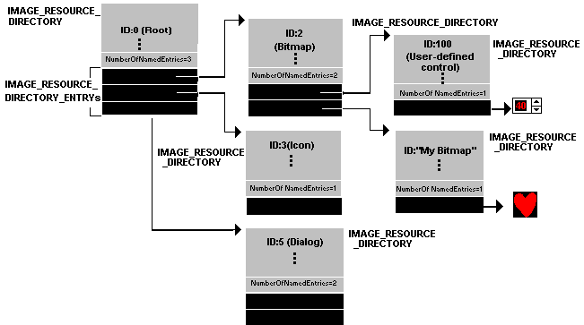

| 数据                         | 说明                                                         |
| :--------------------------- | :----------------------------------------------------------- |
| 资源目录表（和资源目录条目） | 一系列表，树中每组节点对应一个表。 第一个表中列出了所有第一级（类型）节点。 此表中的条目指向第二级表。 每二级树具有相同的类型 ID，但名称 ID 不同。 第三级树具有相同的类型和名称 ID，但语言 ID 不同。 每个单独的表后紧跟目录条目，其中每个条目都有一个名称或数字标识符，以及一个指向数据描述或下一级表的指针。 |
| 资源目录字符串               | 双字节对齐的 Unicode 字符串，用作目录条目指向的字符串数据。  |
| 资源数据描述                 | 由表指向的记录数组，用于描述资源数据的实际大小和位置。 这些记录是资源描述树中的叶。 |
| 资源数据                     | 资源节的原始数据。 资源数据描述字段中的大小和位置信息分隔资源数据的各个区域。 |

---

**1. 资源目录表**

| Offset | 大小 | 字段        | 说明                                                         |
| :----- | :--- | :---------- | :----------------------------------------------------------- |
| 0      | 4    | 特征        | 资源标志。 保留此字段供将来使用。 它当前设置为零。           |
| 4      | 4    | 时间/日期戳 | 资源编译器创建资源数据的时间。                               |
| 8      | 2    | 主要版本    | 主要版本号，由用户设置。                                     |
| 10     | 2    | 次要版本    | 次要版本号，由用户设置。                                     |
| 12     | 2    | 名称条目数  | 紧跟在表之后的目录条目数，这些条目使用字符串来标识类型、名称或语言条目（取决于表的级别）。 |
| 14     | 2    | ID 条目数   | 紧跟在名称条目之后的目录条目数，这些条目对类型、名称或语言条目使用数字 ID。 |

**2. 资源目录条目**

| Offset | 大小 | 字段           | 说明                                                         |
| :----- | :--- | :------------- | :----------------------------------------------------------- |
| 0      | 4    | 名称偏移量     | 提供类型、名称或语言 ID 条目的字符串的偏移量，具体取决于表的级别。 |
| 0      | 4    | 整数标识符     | 标识类型、名称或语言 ID 条目的 32 位整数。                   |
| 4      | 4    | 数据条目偏移量 | 高位 0。 资源数据条目（叶）的地址。                          |
| 4      | 4    | 子目录偏移量   | 高位 1。 较低的 31 位是另一个资源目录表的地址（下一级）。    |

**3. 资源目录字符串**

* 存储在最后一个资源目录条目之后和第一个资源数据条目之前

| Offset | 大小 | 字段           | 说明                                    |
| :----- | :--- | :------------- | :-------------------------------------- |
| 0      | 2    | 长度           | 字符串的大小，不包括长度字段本身。      |
| 2      | 可变 | Unicode 字符串 | 可变长度的 Unicode 字符串数据，字对齐。 |

**4. 资源数据条目**

| Offset | 大小 | 字段             | 说明                                                         |
| :----- | :--- | :--------------- | :----------------------------------------------------------- |
| 0      | 4    | 数据 RVA         | 资源数据区域中资源数据单位的地址。                           |
| 4      | 4    | 大小             | 数据 RVA 字段指向的资源数据的大小（以字节为单位）。          |
| 8      | 4    | codepage         | 用于解码资源数据中的码位值的代码页。 通常，代码页将是 Unicode 代码页。 |
| 12     | 4    | 保留，必须为 0。 |                                                              |

---

* 解析流程：
  * 按序依次解析即可
* 处理代码：

```cpp
void PE32::parse_resources_table()
{
	size_t read_size;

	if (!resource_dir_table_rva || !resource_dir_table_size) return;

	fseek(pe_fp, va_to_raw(resource_dir_table_rva), SEEK_SET);
	read_size = fread(&resource_dir_root, sizeof(___IMAGE_RESOURCE_DIRECTORY), 1, pe_fp);

	if (read_size != 1) {
		fprintf(stderr, "Error: Bad PE file!\n");
		exit(-1);
	}

	// 之后的操作就交给print()函数去处理
}

void PE32::print_resources_table_info()
{

	if (!resource_dir_table_rva || !resource_dir_table_size) {
		fprintf(stdout, "=====No resource table=====\n\n");
		fprintf(stdout, "\n==========END=========\n\n");
		return;
	}

	fprintf(stdout, "=======Resource table======\n\n");

	size_t read_size;
	DWORD total_entries_num = resource_dir_root.NumberOfNamedEntries +
		resource_dir_root.NumberOfIdEntries;
	DWORD i, j;
	
	___IMAGE_RESOURCE_DIRECTORY_ENTRY tmp_entries_0;

	DWORD start_pos = va_to_raw(resource_dir_table_rva);

	// 先读取第一层的entries
	// 这里用递归解析是不是更优雅点？（TODO?）
	for (i = 0; i < total_entries_num; i++) {

		fseek(pe_fp, start_pos + sizeof(__IMAGE_RESOURCE_DIRECTORY) + i * sizeof(___IMAGE_RESOURCE_DIRECTORY_ENTRY), SEEK_SET);

		read_size = fread(&tmp_entries_0, sizeof(___IMAGE_RESOURCE_DIRECTORY_ENTRY), 1, pe_fp);

		if (read_size != 1) {
			fprintf(stderr, "Error: Bad PE!\n");
			exit(-1);
		}

		if (tmp_entries_0.DUMMYUNIONNAME.DUMMYSTRUCTNAME.NameIsString) {
			// 资源ID是字符串
			fseek(pe_fp, start_pos + tmp_entries_0.DUMMYUNIONNAME.DUMMYSTRUCTNAME.NameOffset, SEEK_SET);
			WORD unicode_len;
			fread(&unicode_len, sizeof(WORD), 1, pe_fp);
			wchar_t* name_tmp = (wchar_t*)malloc(sizeof(wchar_t) * (unicode_len + 1));
			if (!name_tmp) {
				fprintf(stderr, "Error: Name_tmp malloc failed!\n");
				exit(-1);
			}
			name_tmp[unicode_len] = 0;
			fread(name_tmp, sizeof(wchar_t), unicode_len, pe_fp);
			fprintf(stdout, " * Name Entry: %ws\n", name_tmp);
			free(name_tmp);
		}
		else {
			// 资源ID是数字
			fprintf(stdout, " * ID Entry: %03d\n", tmp_entries_0.DUMMYUNIONNAME.Id);
		}

		// fprintf(stdout, "    - \n");

		// 解析第二层
		if (tmp_entries_0.DUMMYUNIONNAME2.DUMMYSTRUCTNAME2.DataIsDirectory) {
			// 获取第二级目录表
			DWORD offset = tmp_entries_0.DUMMYUNIONNAME2.DUMMYSTRUCTNAME2.OffsetToDirectory;
			fseek(pe_fp, offset + start_pos, SEEK_SET);
			___IMAGE_RESOURCE_DIRECTORY tmp_dir;
			fread(&tmp_dir, sizeof(___IMAGE_RESOURCE_DIRECTORY), 1, pe_fp);
			DWORD total_entries_num_2 = tmp_dir.NumberOfIdEntries + tmp_dir.NumberOfNamedEntries;

			fprintf(stdout, "    - Entries Count: %d\n", total_entries_num_2);
			fprintf(stdout, "    - Subentries:\n");

			// 依然解析资源名是数字还是字符串
			for (j = 0; j < total_entries_num_2; j++) {

				__IMAGE_RESOURCE_DIRECTORY_ENTRY tmp_entries_1;
				fseek(pe_fp, offset + start_pos + sizeof(___IMAGE_RESOURCE_DIRECTORY) + j * sizeof(__IMAGE_RESOURCE_DIRECTORY_ENTRY), SEEK_SET);
				fread(&tmp_entries_1, sizeof(__IMAGE_RESOURCE_DIRECTORY_ENTRY), 1, pe_fp);

				if (tmp_entries_1.DUMMYUNIONNAME.DUMMYSTRUCTNAME.NameIsString) {

					// 资源名是字符串，解析字符串
					fseek(pe_fp, start_pos + tmp_entries_1.DUMMYUNIONNAME.DUMMYSTRUCTNAME.NameOffset, SEEK_SET);
					WORD unicode_len;
					fread(&unicode_len, sizeof(WORD), 1, pe_fp);
					wchar_t* name_tmp = (wchar_t*)malloc(sizeof(wchar_t) * (unicode_len + 1));
					if (!name_tmp) {
						fprintf(stderr, "Error: Name_tmp malloc failed!\n");
						exit(-1);
					}
					name_tmp[unicode_len] = 0;
					fread(name_tmp, sizeof(wchar_t), unicode_len, pe_fp);
					fprintf(stdout, "       - Name Entry: %ws\n", name_tmp);

				}
				else {

					// 资源名是数字
					fprintf(stdout, "       - ID Entry: %03d\n", tmp_entries_1.DUMMYUNIONNAME.Id);

				}

				// 最后一层资源

				if (tmp_entries_1.DUMMYUNIONNAME2.DUMMYSTRUCTNAME2.DataIsDirectory) {

					___IMAGE_RESOURCE_DIRECTORY_ENTRY tmp_entries_2;
					___IMAGE_RESOURCE_DATA_ENTRY data_entry;

					fseek(pe_fp, start_pos + tmp_entries_1.DUMMYUNIONNAME2.DUMMYSTRUCTNAME2.OffsetToDirectory + sizeof(___IMAGE_RESOURCE_DIRECTORY), SEEK_SET);
					fread(&tmp_entries_2, sizeof(tmp_entries_2), 1, pe_fp);

					fseek(pe_fp, start_pos + tmp_entries_2.DUMMYUNIONNAME2.DUMMYSTRUCTNAME2.OffsetToDirectory, SEEK_SET);
					fread(&data_entry, sizeof(data_entry), 1, pe_fp);

					fprintf(stdout, "          - Resource's RVA: 0x%0X\n", data_entry.OffsetToData);
					fprintf(stdout, "          - Resource's Size: 0x%0X\n", data_entry.Size);

				}

				fprintf(stdout, "\n");
			}
		}
	}

	fprintf(stdout, "\n==========END=========\n\n");

}
```

* 运行结果：

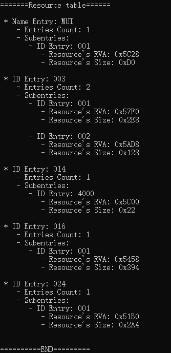

至此，我们已经基本上完成了PE32文件的解析工作。

## Step 4: 解析PE32+

* PE32+，i.e. 64位的PE文件
* PE32与PE32+的区别：

  :one: 第一个很显然的，`NT Header - Optional Header`的`Magic`字段不同，对于`PE32`来说是`10B（NT32）`，对于`PE32+`来说是`20B（NT64）`；

  :two: `PE32+`的`NT Header - Optional Header`与`PE32`不同，主要体现在：

  * `PE32`有一个字段为`BaseofData`，而`PE32+`没有（该4个字节给了`ImageBase`，因为`ImageBase`由4字节扩展到了8字节）；
  * `PE32+`中，`ImageBase`、`SizeOfStackReserve`、`SizeOfStackCommit`、`SizeOfHeapReserve`、`SizeOfHeapCommit`由4字节扩展到8字节，因此`PE32+`的`NT Header64`要比`PE32`的`NT Header32`多出 4*4 = 16字节（如前所述，`BaseofData`的字节已经分给了`ImageBase`）
  * 在`PE32+`中，导入表的导入查找表ITL为64位的数组，而在`PE32`中，其为32位数组，这里需要区分
* 因此，`PE32+`解析与`PE32`解析不同之处：

  * `NT Header`不同：主要指的是`Optional Header`，解析时需要单独处理
  * 导入查找表寻址：`PE32+`以64位进行寻址，而`PE32`以32位进行寻址

  根据上述不同，我们可以很容易发动CV技能（:laughing:）实现对`PE32+`文件的解析


## References:

1. [A dive into the PE file format - PE file structure - Part 1: Overview - 0xRick’s Blog](https://0xrick.github.io/win-internals/pe2/)
2. [A dive into the PE file format - PE file structure - Part 2: DOS Header, DOS Stub and Rich Header - 0xRick’s Blog](https://0xrick.github.io/win-internals/pe3/)
3. [A dive into the PE file format - PE file structure - Part 3: NT Headers - 0xRick’s Blog](https://0xrick.github.io/win-internals/pe4/)
4. [A dive into the PE file format - PE file structure - Part 4: Data Directories, Section Headers and Sections - 0xRick’s Blog](https://0xrick.github.io/win-internals/pe5/)
5. [A dive into the PE file format - PE file structure - Part 5: PE Imports (Import Directory Table, ILT, IAT) - 0xRick’s Blog](https://0xrick.github.io/win-internals/pe6/)
6. [A dive into the PE file format - PE file structure - Part 6: PE Base Relocations - 0xRick’s Blog](https://0xrick.github.io/win-internals/pe7/)
7. [[原创\]打造自己的PE解析器-编程技术-看雪-安全社区|安全招聘|kanxue.com](https://bbs.kanxue.com/thread-252795.htm#msg_header_h2_8)
8. [PE-learning/PE learning at master · jmhIcoding/PE-learning (github.com)](https://github.com/jmhIcoding/PE-learning/tree/master/PE learning)
9. [A dive into the PE file format - LAB 1: Writing a PE Parser - 0xRick’s Blog](https://0xrick.github.io/win-internals/pe8/#a-dive-into-the-pe-file-format---lab-1-writing-a-pe-parser)
10. [Virus Bulletin :: VB2019 paper: Rich Headers: leveraging this mysterious artifact of the PE format](https://www.virusbulletin.com/virusbulletin/2020/01/vb2019-paper-rich-headers-leveraging-mysterious-artifact-pe-format/)
11. [VirtualAddress与VirtualSize与SizeOfRawData与PointerToRawData的关系 - zpchcbd - 博客园 (cnblogs.com)](https://www.cnblogs.com/zpchcbd/p/14674298.html)
12. [PE Format - Win32 apps | Microsoft Learn](https://learn.microsoft.com/en-us/windows/win32/debug/pe-format#special-sections)
13. [PE Format - Win32 apps | Microsoft Learn](https://learn.microsoft.com/en-us/windows/win32/debug/pe-format#the-idata-section)
14. [PE 格式 - Win32 apps | Microsoft Learn](https://learn.microsoft.com/zh-cn/windows/win32/debug/pe-format#the-edata-section-image-only)
15. [research32: Base relocation table](http://research32.blogspot.com/2015/01/base-relocation-table.html)
16. [PE 格式 - Win32 apps | Microsoft Learn](https://learn.microsoft.com/zh-cn/windows/win32/debug/pe-format#the-reloc-section-image-only)